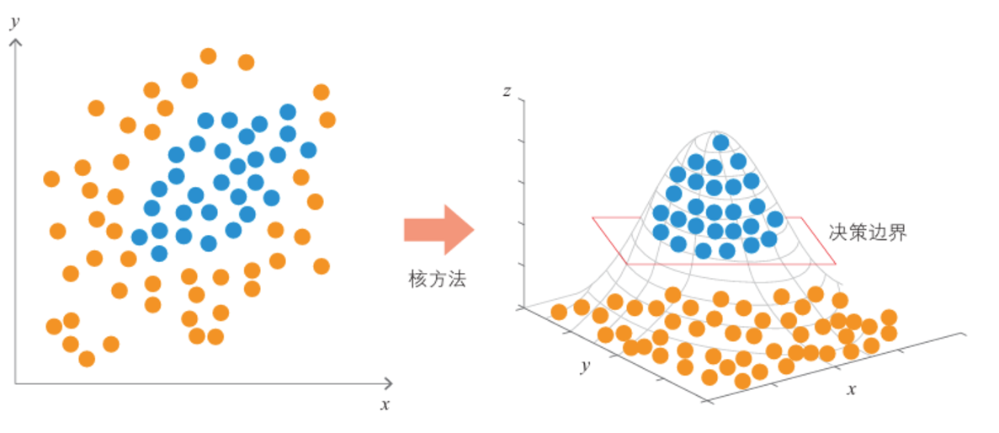
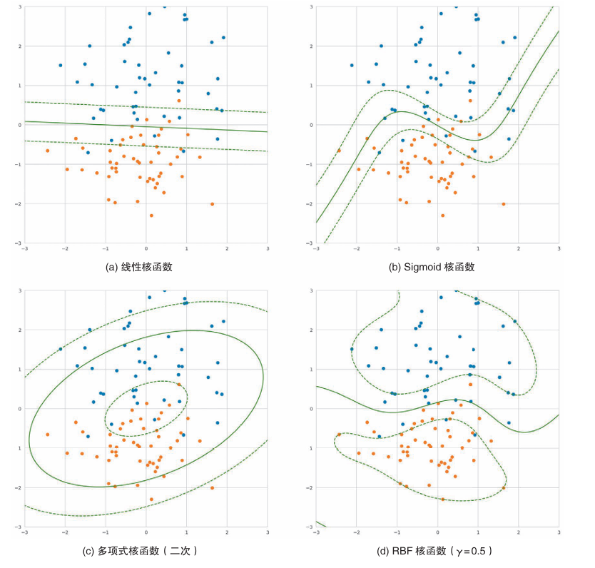
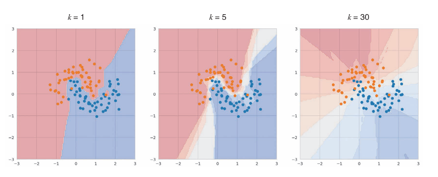

# 非线性回归任务对比

## 非线性回归任务概述

相比于线性回归，非线性回归的自变量和因变量之间的关系是曲线型的。

非线性回归模型会有多种形式
* 多项式回归
* 指数回归
* 对数回归
* 双曲正切回归
* Sigmoid函数
* ...

对于非线性回归模型，可以通过数学变换转换成线性回归的形式。也可以通过对应的训练模型来处理。

## 数据预处理

数据预处理的方式与线性回归相似，都是将数据集拆分位训练集和测试集两部分。下面用手写数字数据集作为例子。

```python
from sklearn.datasets import load_digits
from sklearn.neural_network import MLPClassifier
from sklearn.model_selection import train_test_split
from sklearn.metrics import accuracy_score
data = load_digits()
X = data.images.reshape(len(data.images), -1)
y = data.target
X_train, X_test, y_train, y_test = train_test_split(X, y, test_size=0.3)
```

* `load_digits()` 函数加载了一个包含手写数字图像（8x8像素）的数据集，其中每个图像对应一个标签，代表数字的类别（0到9）。
* `X` 是包含所有图像特征的数据集，每一行是一个图像，形状为 (1797, 64)，即 1797 个样本，每个样本是一个 8x8 的图像（展平后是64个特征）。
* `y` 是标签（数字0-9），形状为 (1797,)，即每个图像对应的数字标签。

将数据集拆分为训练集（70%）和测试集（30%），确保模型训练时没有使用测试数据。

## 模型训练及评估

```python
model = model = MLPClassifier(hidden_layer_sizes=(16, ))
model.fit(X_train, y_train)  # 训练
y_pred = model.predict(X_test)
accuracy_score(y_pred, y_test)  # 评估
```

- `MLPClassifier` 是多层感知器分类器，用于执行神经网络分类任务。
- `hidden_layer_sizes=(16, )` 表示模型的隐藏层具有 16 个神经元。这里只定义了一个隐藏层。
- `model.fit(X_train, y_train)` 在训练数据上训练模型。
- 使用训练好的模型对测试集进行预测，得到预测结果 `y_pred`。
- `accuracy_score(y_pred, y_test)` 计算模型在测试集上的准确率，比较模型的预测结果和真实标签 `y_test`。

## 支持向量机（核方法）

核方法（kernel methods）是一种用于处理无法人力标注特征值的复杂在数据的技巧。

将数据引入一个更高维度的空间，就可以将原本线性不可分的数据变为线性可分。同时，支持向量机可以在高维空间中找到适合的决策边界再投影回原始的低维空间。



通过核函数，核方法可以无须构建具体的高维空间。

```python
model = SVC()
model.fit(X_train, y_train)
```

代码中没有明确指定使用哪个核方法，因为默认使用RBF（Radial Basis Function，径向基函数）核方法。

### 结果展示



不同的核函数得到的决策边界的形状也不同。

## 随机森林

随机森林采用决策树作为弱分类器，在bagging的样本随机采样基础上，⼜加上了特征的随机选择。

当前结点特征集合（d个特征），随机选择k个特征子集，再选择最优特征进行划分。k控制了随机性的引入程度，推荐值：$k=log_2d$

对预测输出进行结合时，分类任务——简单投票法；回归任务——简单平均法

```python
from sklearn.ensemble import RandomForestRegressor
rf = RandomForestRegressor(n_estimators=500, oob_score=True, random_state=0)
rf.fit(X_train, y_train)
```

### 参数解释

- n_estimators：参数控制随机森林中决策树的数量。更多的树通常能提高模型的性能，但也会增加计算成本。增加 n_estimators 可以提高模型的稳定性，减少单棵树的过拟合风险，但同时增加训练时间和内存消耗。
- random_state：随机种子
- oob_score：是否使用袋外样本来估计泛化精度。默认False。

## 神经网络

在开头引用的例子便是神经网络模型。其将输入层读入的数据在中间层用Sigmoid等非线性函数计算，在输出层也使用非线性函数计算并输出结果。

```python 
model = Sequential()
model.add(Dense(64, activation='relu', input_shape=(X_train.shape[1],)))
model.add(Dropout(0.5))
model.add(Dense(64, activation='relu'))
model.add(Dropout(0.5))
model.add(Dense(1, activation='sigmoid'))
model.compile(loss='binary_crossentropy',
              optimizer=Adam(),
              metrics=['accuracy'])
history = model.fit(X_train, y_train,
                    epochs=20,  # 训练轮数
                    batch_size=128,  # 批量大小
                    validation_split=0.2)  # 使用20%的数据作为验证集
# 评估模型
test_loss, test_acc = model.evaluate(X_test, y_test)
```

### 参数解释

- **Sequential Model**：`Sequential` 是一种线性堆叠模型，意味着你可以一层接一层地添加层。
  
- **Dense Layer**：`Dense` 层是全连接层，每个节点都与上一层的所有节点相连。第一层需要指定 `input_shape` 参数，表示输入特征的形状。激活函数 'relu' （Rectified Linear Unit）被广泛应用于隐藏层中。

- **Dropout Layer**：`Dropout` 是一种正则化技术，它随机地按照一定比例关闭一些节点，以防止模型过拟合。这里的 `0.5` 表示每次更新参数时，随机丢弃一半的单元。

- **Output Layer**：最后一层只有一个节点，并使用了 'sigmoid' 激活函数，这适用于二分类问题，输出可以解释为属于某一类的概率。

- **Compile**：在编译阶段，我们指定了损失函数（`binary_crossentropy` 对于二分类问题很常见）、优化算法 (`Adam`) 和评估模型性能的指标（如准确率 `accuracy`）。

## KNN

KNN训练时不用计算，无须在意数据是否线性，所以可以用于非线性回归。

其将未知数据和训练数据的距离进行计算，通过多数表决找到最邻近的k个点，再进行分类。

```python
knn = KNeighborsClassifier(n_neighbors=3)
# 训练模型
knn.fit(X_train, y_train)
# 使用模型进行预测
y_pred = knn.predict(X_test)
```

### 参数解释
- **n_neighbors** :即k值，是邻居的数量。

### 结果展示

k值不同的决策边界结果哦不同



