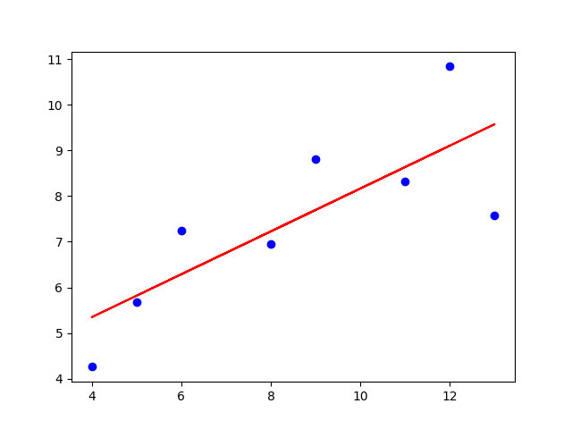
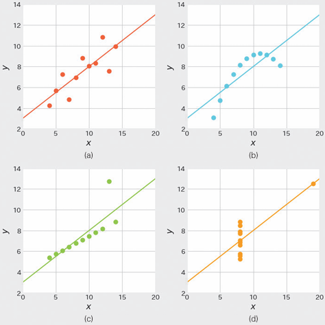

# 线性回归

## 概述

线性回归很常见，简单带过，就是把xy对应数据拟合成线性关系。

对于直线方程，有 $y = kx +b$，其中有两个参数也就是k和b分别是斜率和截距。

- 学习参数：算法学得的参数例如斜率k和截距b。
- 一元回归：指的是只有一个特征变量的情况，即模型只使用一个自变量去预测目标变量。

## 算法说明

线性回归中，需要从不在一条直线上的点求出直线。为了判断学习参数的优劣性，使用均方误差进行判断。

均方误差：每个目标变量与直线的差值平方和

$\frac{1}{n} \sum_{i=1}^{n} \left[ y_i - (b + k x_i) \right]^2$

均方误差越小，越能更好的表示数据关联性。

- 误差函数：能表明学习参数和误差之间的关系的函数，例如此处的均方误差。

## 线性回归代码演示

```python
from sklearn.linear_model import LinearRegression
import matplotlib.pyplot as plt
import numpy as np
from sklearn.model_selection import train_test_split
X = [[10.0], [8.0], [13.0], [9.0], [11.0], [14.0], [6.0], [4.0], [12.0], [7.0], [5.0]]
y = [8.04, 6.95, 7.58, 8.81, 8.33, 9.96, 7.24, 4.26, 10.84, 4.82, 5.68]
# 划分训练集和测试集，test_size 指定测试集的比例
X_train, X_test, y_train, y_test = train_test_split(X, y, test_size=0.2, random_state=42)
model = LinearRegression()
model.fit(X_train, y_train)
print(model.intercept_) # 截距
print(model.coef_) # 斜率
y_pred = model.predict([[0], [1]])
print(y_pred) # 对x=0, x=1的预测结果
# 绘制数据集散点图
plt.scatter(X_train, y_train, color='blue', label='Data')
# 绘制回归线
y_pred = model.predict(X_train)
plt.plot(X_train, y_pred, color='red', label='Linear Regression Model')
plt.show()
```



## 详细说明

### 安斯库姆四重奏

**安斯库姆四重奏**（Anscombe's Quartet）是一组由统计学家弗朗西斯·安斯库姆（Francis Anscombe）在 1973 年提出的数据集。它由四组不同的数据构成，尽管这些数据在许多统计属性上（如均值、方差、相关系数、线性回归直线等）非常相似，但它们的分布形态却大不相同。



以上的四组数据线性回归直线完全一致，但我们明显可以发现有部分的数据并不适合这样拟合。

对原本不遵循线性分布的数据强行进行线性回归也得不到好的结果。拿到数据之后，首先应该进行可视化，再考虑是否进行线性回归。

### 最小化均方误差

均方误差可以使用学习参数的函数表示：

$L(w_0, w_1) = \frac{1}{n} \sum_{i=1}^{n} \left[ y_i - (b + k x_i) \right]^2$

此时代入xi yi，这里使用以下值作为例子

| i    | x    | y    |
| ---- | ---- | ---- |
| 1    | 2    | 1    |
| 2    | 3    | 5    |
| 3    | 6    | 3    |
| 4    | 7    | 7    |

可以得到以下 $L(b, k) = \frac{1}{4} \sum_{i=1}^{4} \left[ y_i - (b + k x_i) \right]^2 = b^2 + 24.5k^2 + 9b k - 8b - 42k + 21$ 由此二次函数可得图像（w0=b，w1=k）：


可以发现a点是最佳学习参数

### 其它线性回归和非线性回归

- 一元回归：指独立特征变量只有一个时的线性回归。
- 多元回归：当特征变量有两个及以上时，称作多元回归。
- 多项式回归：包含特征变量的多次方项的线性回归。
- 非线性回归：例如e的kx次，学习参数和目标变量不是线性关系，被分为非线性回归。

是否为线性回归不是从特征变量来看的。从学习参数的角度来看是线性的回归才称为线性回归，所以多项式回归也属于线性回归。