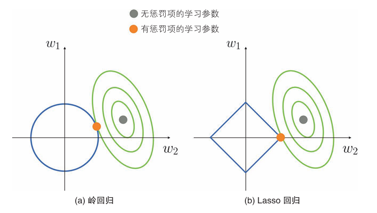

# 正则化

## 概述

正则化是防止过拟合的一种方法，与线性回归等算法配合使用。通过向损失函数增加惩罚项的方式对模型施加制约，有望提高模型的泛化能力。

- 过拟合：模型在验证数据上的误差比训练数据的误差大得多的现象
- 泛化程度：机器学习模型在新数据上的表现能力，具体来说是模型能否在训练集之外的数据上取得良好的性能。

（其中的一个原因：模型复杂度过高）

对于以下例子，数据是y = sin(2pi x)，使用多次进行线性回归。


| 次数 | x     | y     |
| ---- | ----- | ----- |
| 1    | 0.412 | 0.618 |
| 2    | 0.176 | 0.193 |
| 3    | 0.081 | 0.492 |
| …    | …     | …     |
| 6    | 0.024 | 3.472 |

我们可以发现第六次线性回归的误差值是最小的，但是验证误差十分大，这就是一个过拟合的例子，六次线性回归的模型太过复杂，由于过拟合导致泛化程度低。

应用正则化后就会抑制模型复杂度，防止后期的过拟合。

## 算法说明

岭回归（Ridge Regression）是一种线性回归的改进方法，常用于解决多重共线性问题（即解释变量之间高度相关）和防止模型过拟合。

之所以复杂模型会出现过拟合：学习参数值太大或太小。

随着学习此处的增加，学习参数的绝对值会变大，但使用了正则化则会减少这种情况。

### 岭回归的误差函数

考虑对二次线性回归应用正则化的情况：

$R(w) = \sum_{i=1}^{m} \left[ y_i - (w_0 + w_1 x_i + w_2 x_i^2) \right]^2 + \alpha (w_1^2 + w_2^2)$

第1项 $\sum_{i=1}^{m} \left[ y_i - (w_0 + w_1 x_i + w_2 x_i^2) \right]^2$ 是线性回归的损失函数。

第2项 $\alpha (w_1^2 + w_2^2)$ 被称为惩罚项（或者正则化项），是学习参数的平方和的形式。

一般来说，惩罚项中不包含截距。

α控制了正则化强度，α越大，对学习参数的抑制就越强。

### 损失函数最小化

岭回归的误差函数就是在后面加上了惩罚项，距我们之前所说，造成过拟合的原因是w值的绝对值过大，因此如果w值的绝对值过大，就增加惩罚项，从而避免过拟合。

用于抑制学习参数。

### 示例代码

对sin函数进行岭回归建模

```python
import numpy as np
from sklearn.preprocessing import PolynomialFeatures
from sklearn.linear_model import Ridge
from sklearn.metrics import mean_squared_error
train_size = 20
test_size = 12
train_X = np.random.uniform(low=0, high=1.2, size=train_size)
test_X = np.random.uniform(low=0.1, high=1.3, size=test_size)
train_y = np.sin(train_X * 2 * np.pi) + np.random.normal(0, 0.2, train_size)
test_y = np.sin(test_X * 2 * np.pi) + np.random.normal(0, 0.2, test_size)
poly = PolynomialFeatures(6)  # 次数为6
train_poly_X = poly.fit_transform(train_X.reshape(train_size, 1))
test_poly_X = poly.fit_transform(test_X.reshape(test_size, 1))
model = Ridge(alpha=1.0)
model.fit(train_poly_X, train_y)
train_pred_y = model.predict(train_poly_X)
test_pred_y = model.predict(test_poly_X)
print(mean_squared_error(train_pred_y, train_y))
print(mean_squared_error(test_pred_y, test_y))
# 0.2525090370132518
# 0.34030978733484846
```

## 详细说明

控制α来调整正则化强度，应一边验证误差一边对α进行调整，最终得到合适的α。

### Lasso回归

$R(w) = \sum_{i=1}^{n} \left[ y_i - (w_0 + w_1 x_i + w_2 x_i^2) \right] + \alpha (|w_1| + |w_2|)$

Lasso 回归的惩罚项是学习参数的绝对值之和，这一点与岭回归不同。



绿色是误差函数，蓝色是惩罚项。

如Lasso 回归所示，具有学习参数容易变为0的特点。利用这个特点，我们可以使用学习参数不为0的特征来构建模型，从而达到利用Lasso回归选择特征的效果。这样不仅能提高模型的泛化能力，还能使模型的解释变容易。