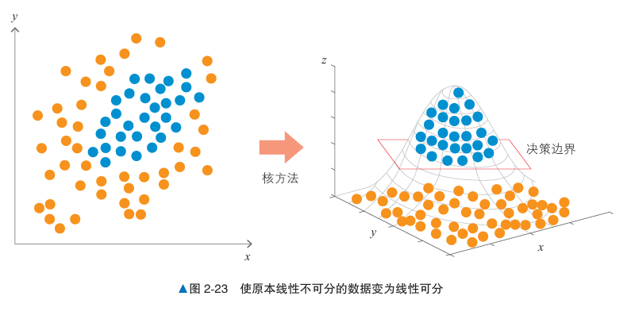

# 支持向量机（核方法）

## 概述

在支持向量机中引入核方法（kernel methods）这个技巧，那些无法人力标注特征值的复杂 数据也能被处理。当然，这个算法现在也用于解决各种分类和回归问题。

对于支持向量机来说，如果数据是以中心，外围的模式分成两组，直线的决策边界就无法进行处理。

## 算法说明

核方法的一个常见解释是“将数据移动到另一个特征空间，然后进行线性回归”。

将线性不可分的数据变为线性可分的一种方法是引入更高维度的空间。

通过在更高维空间中表示训练数据，每个原始数据点可以映射成高维空间中的一个点，这些点在高维空间中是线性可分的。此时，支持向量机可以在高维空间中找到适合的决策边界。然后将该决策边界投影回原始的低维空间，就得到了一个可以有效分类的边界。



虽然构建线性分离的高维空间非常困难，但通过一个叫作核函数的函数，核方法就可以使用在 高维空间中学习到的决策边界，而无须构建具体的线性分离的高维空间。

### 示例代码

```python
from sklearn.svm import SVC
from sklearn.datasets import make_gaussian_quantiles
from sklearn.model_selection import train_test_split
from sklearn.metrics import accuracy_score
# 生成数据
X, y = make_gaussian_quantiles(n_features=2, n_classes=2, n_samples=300)
X_train, X_test, y_train, y_test = train_test_split(X, y, test_size=0.3)
model = SVC()
model.fit(X_train, y_train) 
y_pred = model.predict(X_test) 
accuracy_score(y_pred, y_test)
```

## 详细说明

核方法中可以使用的核函数多种多样。使用不同的核函数，得到的决策边界的形状也不同。


因此可以知道，在不同的核函数下，可以进行不同的甚至更复杂的决策边界分割。

由于这些特点，在使用支持向量机时，不宜立即使用非线性核函数，在此之前，应先使用线性核函数进行分析，以了解数据。