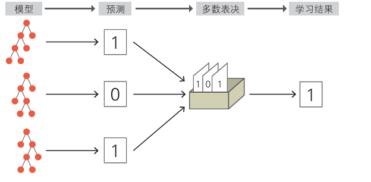
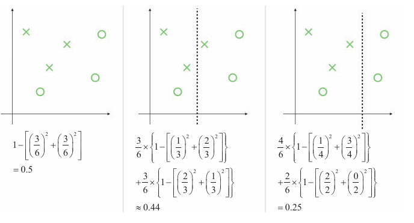
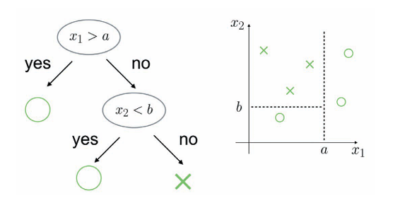
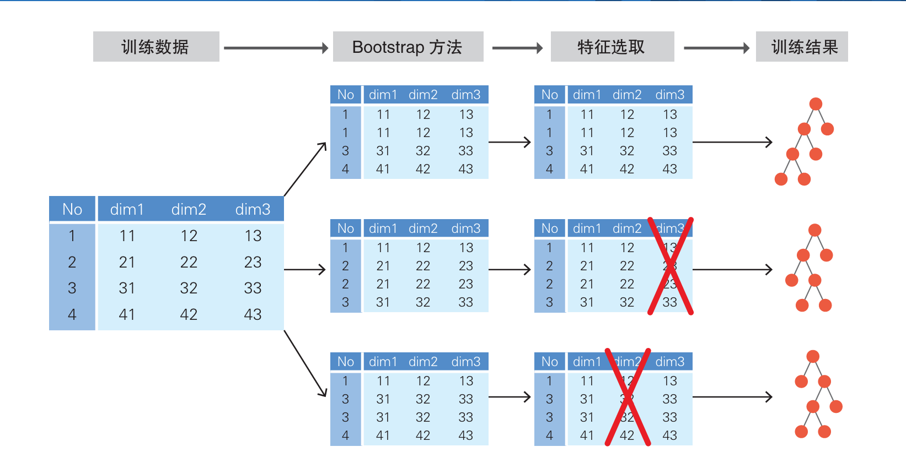
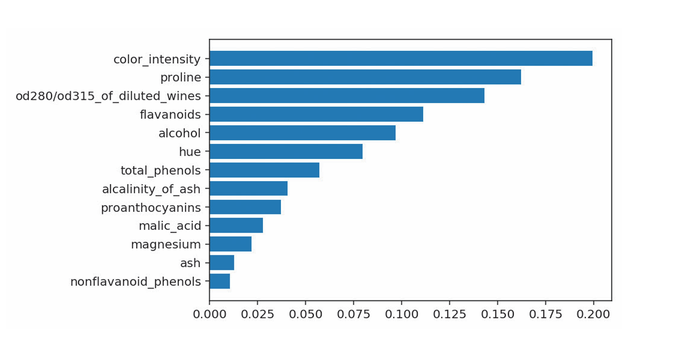

# 算法7：随机森林

##  概述

随机森林通过多个决策树模型来共同解决问题的算法。单个决策树的性能不一定够高，由多个决策树多数表决得到的结果能有更高的预测精度。



如果每个决策树的结果相同，那么最后的表决结果也不会有变化，所以每个决策树要具备多样性，以下介绍。

## 算法说明

### 决策树

决策树是将训练数据进行划分的方法。

决策树的输入通常是 特征矩阵 与 标签向量，相当于数据内容和分类结果。

训练数据的杂乱程度称为不纯度。利用不纯度来比较分割方法的优劣。

表示不纯度的具体指标有很多，如基尼系数。

基尼系数 = $1-\sum_{i=1}^c p_i^2$（c是标签数，pi是某标签的数量在总数的占比）

所示为使用几种不同的分割方法计算得出的 加权平均基尼系数（区域内的基尼系数乘以区域在总数占比）

左侧是分割前的状态。右侧是使基尼系数的平均值最小的分割方法的例子。



决策树便是通过反复分割来进行的。

步骤：

- 计算某个区域的所有特征值和候选分割的不纯度.
- 以分割时不纯度减小最多的分割方式分割区域。
- 对于分割后的区域，重复步骤1和步骤2。
    


### 随机森林

随机森林如何使用多个决策树来提高正确率：

- 假设每个决策树的正确率都是60%
- 对于训练后决策树，每次的输入都会给定一个答案，n个决策树都给出正确率为60%的答案
- 服从多数正确，最后的正确率会大于60%

决策树如何在相同数据下独立：

- Bootstrap方法：每个决策树获得的样本集是 n 次的 有放回的随机抽取 集合（也就是单个数据可能重复）。
- 随机选取特征值：对于每个节点的分裂，不使用全部特征，而是随机选择一个特征子集来决定分裂。
  
  

随机森林利用这种方式创建多棵数据集、训练多棵决策树、对预测结果进行多数表决，返回最终的分类结果。

## 示例代码

用随机森林基于3种葡萄酒的各种测量值数据，对葡萄酒进行分类。

``` python
from sklearn.datasets import load_wine
from sklearn.ensemble import RandomForestClassifier
from sklearn.model_selection import train_test_split
from sklearn.metrics import accuracy_score
 # 读取数据
data = load_wine()
 X_train, X_test, y_train, y_test = train_test_split(
    data.data, data.target, test_size=0.3)
model = RandomForestClassifier()
model.fit(X_train, y_train)  # 训练
y_pred = model.predict(X_test)
accuracy_score(y_pred, y_test)  # 评估
```

## 详细说明

### 特征的重要度

随机森林可以让我们知道每个特征对预测结果的重要度（影响大小）。

通过对随机森林的所有决策树求在以某个特征分割时的不纯度并取平均值，可以得到特征的重要度。

将重要度高的特征用于分割，有望大幅度减小不纯度。反之，重要度低的特征即使被用于分割，也无法减小不纯度，所以可以说这样的特征是非必要的。基于特征的重要度，我们可以去除非必要的特征。

下图为使用随机森林算出的葡萄酒分类中的特征重要度，重要度最高的特征color_intensity表示色泽对葡萄酒分类非常重要。

  