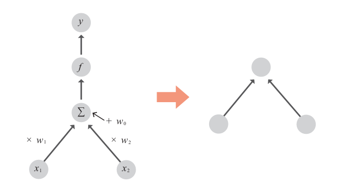
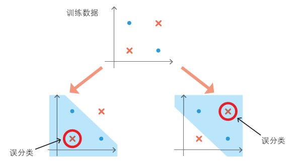
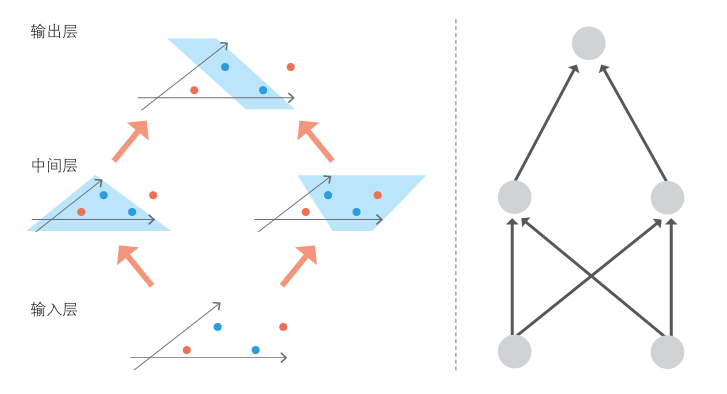
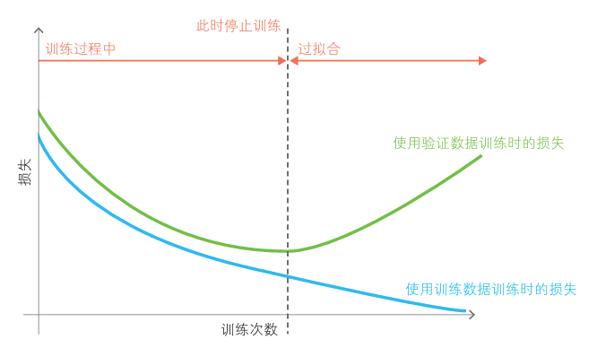

# 算法8 神经网络

## 概述

神经网络由输入层、中间层、输出层组成，常用于分类问题。其中中间层最为重要，能够学习复杂的决策边界。


如图为典型的神经网络的的网络结构。其中左侧输入层为三维数据，是输入数据本身，中间层为二维，右侧输出层为一维，取输入数据分类结果的概率。


如图为一个具体例子，对一个叫做MNIST的手写数字数据集进行分类，其中包含0到9十个手写数字的8*8的灰度图片。

下图为MNIST的神经网络示意图（忽略了各节点连线）


对于8x8的图像，左侧输入层将各个点的像素值存储在长度为64的一维数组中，可视为64维。

中间层使用Sigmoid 等非线性函数计算输入层传来的数据，设置为16维。

输出层也使用非线性函数计算中间层传来的数据。

输出图像是0~9这十个数字的概率。  


由图中可看出神经网络能正确识别这些手写数字。  

## 算法说明

### 简单感知机

简单感知机由输入层和输出层构成，是将非线性函数应用于对特征值加权后的结果并进行识别的模型。它的工作原理基于加权求和和阶跃函数

举例：某特征维度为2，输入特征值为$(x_1,x_2)$，使用非线性函数 f 计算概率 y ：  
$y=f(w_0+w_1x_1+w_2x_2)$

- 加权求和：特征值的系数w1和w2称为 权重，常数项w0称为偏置。
- 激活函数：例如Sigmoid 可以将加权值转为一个概率值，通常激活函数后的输出通常是一个连续值，Sigmoid适合二值分类，如果要多分类，Softmax函数将更适合。

  

图中是简单感知机的示意图，右图为简化图。

对于感知机的权值确定，感知机的权重在理想情况下在多次训练后会逐渐收敛到一个能够完美分割数据的解，前提是训练数据是线性可分的。如果数据是线性可分的，感知机算法保证最终会收敛。

### 神经网路

神经网络（Neural Network）可以看作是由多个感知机（Perceptron）通过分层构建而成的。

简单感知机不能很好学习某些数据的决策边界，如下图，典型的数据不是线性可分。



于是我们需要借用多个感知机，并进行一些处理。进行一个分层：

对这个例子 设置两个中间层

- 区分右上角的点和其他点的层
- 区分左下角的点和其他点的层

然后，设置综合这两个输出结果，同样利用简单感知机生成最终决定的层。通过这种做法，我们就可以根据数据是否进入被两条直线夹住的地方来分类了。示意图如下。



通过调节中间层的数量及层的深度可以学习更复杂的边界。如图。


### 示例代码

``` python
from sklearn.datasets import load_digits
from sklearn.neural_network import MLPClassifier
from sklearn.model_selection import train_test_split
from sklearn.metrics import accuracy_score
# 读取数据
data = load_digits()
X = data.images.reshape(len(data.images), -1)
y = data.target
X_train, X_test, y_train, y_test = train_test_split(X, y, test_size=0.3)
model = model = MLPClassifier(hidden_layer_sizes=(16, ))
model.fit(X_train, y_train)  # 训练
y_pred = model.predict(X_test)
accuracy_score(y_pred, y_test)  # 评估
```

## 详细说明

模型复杂之后容易过拟合。Early Stopping这种方法可以防止过拟合。

### Early Stopping

早停法指进入过拟合之前停止训练来防止过拟合。  

它进一步划分训练数据，将其中一部分作为训练中的评估数据。在训练过程中据此以此记录损失等评估指标，以了解训练的进度。如果损失开始恶化，出现过拟合的趋势，则停止训练。

