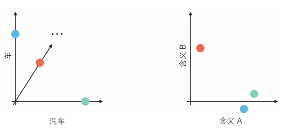
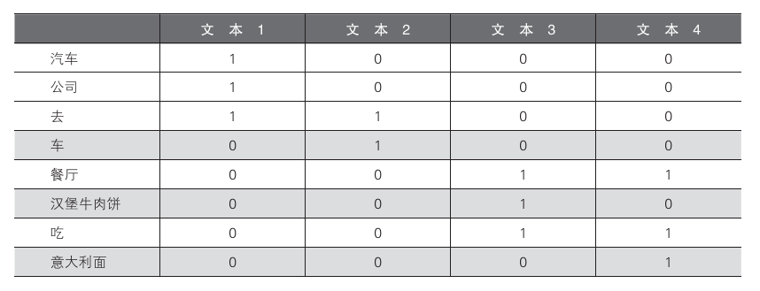
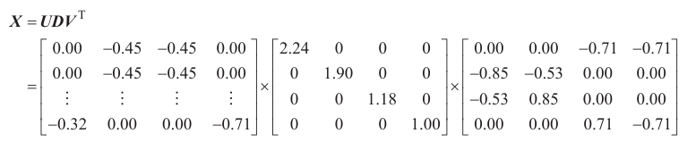
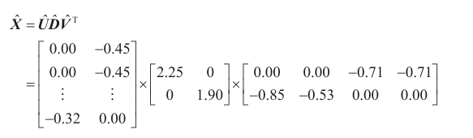
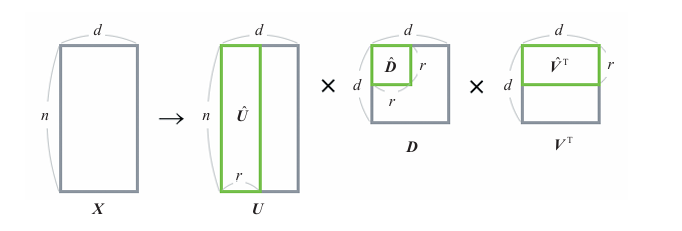
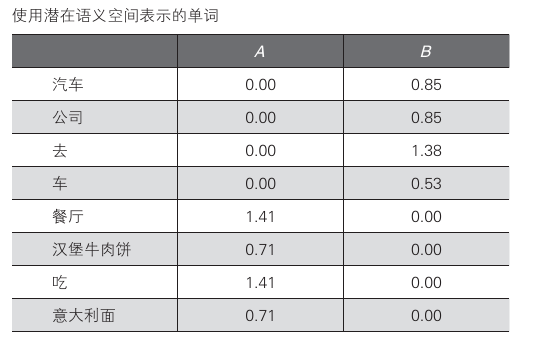

# 算法11：LSA

## 概述

LSA（Latent Semantic Analysis，潜在语义分析）是一种自然语言处理技术，常用于信息搜索领域。

作为一种降维算法，它能够从大量文本数据中找出单词之间的潜在关联性。

以前的信息搜索方法是将搜索对象的文本中的单词建立索引，若索引与搜索关键词相同，则将文本加入到搜索结果中。

但这种方法有一个缺点，如果索引与搜索关键字有丝毫不同，那就无法很好找到信息。假设有一篇索引中包含“车”的文章，在使用“汽车”这个搜索关键字搜索时，就会出现搜索结果中没有这篇文章的问题（同义性的问题）。

而LSA就可以根据大量文本自动计算单词之间的相似度，以及单词和文本的相似度。

通过LSA对文本和单词的矩阵进行降维，将其变换为*潜在语义空间*（如下图）。这种变换使用矩阵分解进行。

* 矩阵分解是指将某个矩阵表示为多个矩阵的乘积的形式。（如何应用于无监督学习的降维算法见" 算法说明 "）


在单词空间中车和汽车当作正交维度处理，而在语义空间中，二者被表示为相似的单词。

## 算法说明

以下结合具体例子

首先将以下文本变换为矩阵$X$。矩阵$X$的各元素是文本中出现的单词的个数。

* 坐汽车去公司
* 坐车去的
* 在餐厅吃汉堡牛肉饼
* 在餐厅吃意大利面



对矩阵分解后



其中，$U$是包含单词和归纳的特征的变换信息的矩阵，$D$是包含信息的重要度的矩阵，$V$是包含归纳的特征和文本的变换信息的矩阵。

$D$是一个对角矩阵，其对角元素按信息的重要度从大到小排列。

在使用三个矩阵降维时，重点关注$D$。现考虑以下需求，

* 原始数据有4个特征，但我们希望将其降维到2个特征。

从$D$的4个值中选出最重要的2个，建立一个2行2列的对角矩阵。为了匹配这个$D$，我们相应地删去$U$的第3列和第4列，以及$V^T$的第3列和第4列，将它们分别变形为8行2列和2行4列的矩阵。



该矩阵乘积是原矩阵的近似，即使只用了一半的值，还是在一定程度上保留了原来的信息。

当作为降维算法使用时，我们要用到的是在变换为原始特征的形式之前（在乘以$\widehat{V}^T$之前的$\widehat{U}\widehat {D}$。$\widehat{U}\widehat {D}$是一个8行2列的矩阵，我们可以将其解释为从归纳的特征中选择的2个重要度高的特征。



以下是关于$\widehat{U}\widehat {D}$的具体数值，将两个特征设为A和B。


“汽车”和“车”拥有变量B的值，“汉堡牛肉饼”和“意大利面”拥有变量A的值。A和B的特征值显示了各个单词之间的关联性。

## 示例代码

假设一个使用8个变量（=单词的个数）表示的数据集，现用2个潜在变量去表示它。

``` python
from sklearn.decomposition import TruncatedSVD
data = [[1, 0, 0, 0],
        [1, 0, 0, 0],
        [1, 1, 0, 0],
        [0, 1, 0, 0],
        [0, 0, 1, 1],
        [0, 0, 1, 0],
        [0, 0, 1, 1],
        [0, 0, 0, 1]]
n_components = 2  # 潜在变量的个数
model = TruncatedSVD(n_components=n_components)
model.fit(data)
print(model.transform(data))  # 变换后的数据
print(model.explained_variance_ratio_)  # 贡献率
print(sum(model.explained_variance_ratio_))  # 累计贡献率
```

另外，与PCA一样，我们也可以检查LSA变换后的矩阵中包含多少原始信息。使用了scikit-learn的上述代码输出的累计贡献率约为0.67，表明这2个变量包含了约67%的原始数据的信息。

## 详细说明

### 使用LSA时的注意事项

“算法说明”部分提到的矩阵分解是一种叫作*奇异值分解*的技术。使用了奇异值分解的LSA在信息检索中的应用备受关注，它具有以新的空间表示文本等优点。但有以下问题：

* 变换后的矩阵难以解释。在通过奇异值分解降维时，各个维度可能是正交的，矩阵中的元素也可能是负值。因此，与之相比，还是后面即将介绍的NMF和LDA等算法的结果更容易
解释。
* LSA的计算成本有时很高。单词个数与维度相关，可能会有非常大的矩阵。
* 更新难度大，随着新词加入，原有矩阵需重建。