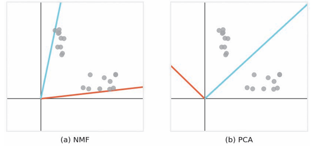
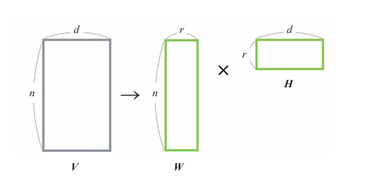
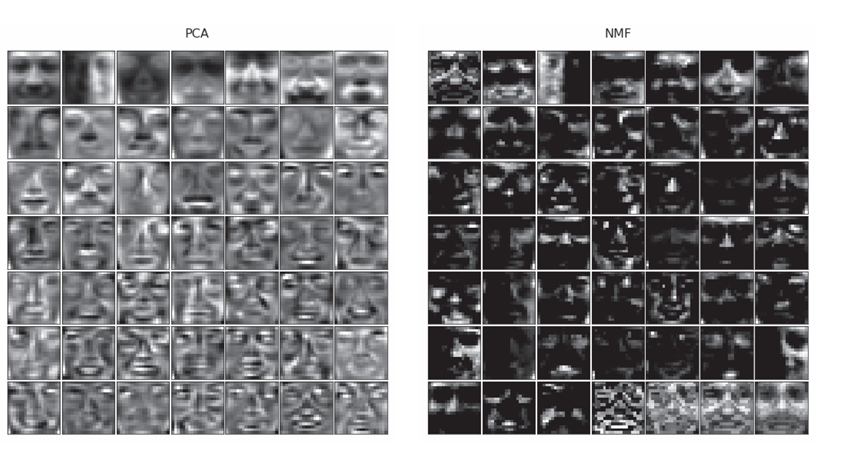

# 算法12：NMF

## 概述

NMF(Non-negative Martix Factorization,非负矩阵分解)是一种矩阵分解方法。

NMF有以下特点：

*  原始矩阵的元素是非负数。
*  分解后矩阵的元素是非负数。
*  没有“潜在语义空间的每一个维度都是正交的”这一约束条件。

这些特点会带来几个优点

* 分析结果的可解释性强，例如，在将NMF应用于文本数据时，由于文本能够以潜在变量的加法来表示，所以可以使用NMF对文本进行降维，然后将潜在变量视为主题，这样就能使用“某个文本的主题A为0.5、主题B为0.3……”的方式描述文本的信息。
* 各个潜在变量可能有一定程度的信息重复。符合真实数据的建模。因为其没有“潜在变量必须正交”的约束条件。

以下分别为对二维数据应用NMF和PCA的结果。



可以看出NMF的潜在空间的每个轴都有重复信息。这一特性使得我们可以捕捉到多个数据块的特征。

而PCA等算法则由于其潜在空间的维度是正交的，所以无法找到所有数据块的特征。

## 算法说明

设原始数据为$n$行$d$列的矩阵$V$，将其表示为两个矩阵$W$和$H$的乘积。$W$是$n$行$r$列的矩阵，$H$是$r$行$d$列的矩阵，$WH$是原始矩阵$V$的近似，选择比$d$小的$r$就可以进行降维。这时，$W$的每一行都是对V的每一行降维后的结果。



在求$W$和$H$的过程中，NMF在$W ≥ 0、H ≥ 0$的条件下，使$WH$接近$V$。

NMF采取“将$H$视为常数，更新$W$”“ 将$W$视为常数，更新$H$”的方式交替更新$W$和$H$.

以下对NMF过程进行可视化。

灰色的点为原始矩阵$V$，绿色的点为近似矩阵$WH$。随着计算的进行，我们可以看到近似矩阵越来越接近原始矩阵。此外，红线和蓝线是潜在空间的轴，所有近似矩阵的图形都能在潜在空间（二维空间）的轴上表示出来

*  将$W$和$H$初始化为正值。
*  将$H$视为常数，更新$W$。
*  将$W$视为常数，更新$H$。
*  当$W$和$H$收敛时，停止计算。
  


## 示例代码

``` python
from sklearn.decomposition import NMF
from sklearn.datasets.samples_generator import make_blobs
centers = [[5, 10, 5], [10, 4, 10], [6, 8, 8]]
V, _ = make_blobs(centers=centers)  # 以centers为中心生成数据
n_components = 2  # 潜在变量的个数
model = NMF(n_components=n_components)
model.fit(V)
W = model.transform(V) # 分解后的矩阵
H = model.components_
print(W)
print(H)
```

## 详细说明

### NMF与PCA的比较

将NMF和PCA应用到一个人脸数据集上（19像素×19像素，2429张），降维后由49个变量表示数据。即将361个特征变换为49个潜在变量。

将49个潜在变量可视化



左图为PCA结果，每张图像表示了人的整个面部。右图为NMF的结果，暗区较多，但这些区域的值为0.。每个潜在变量代表了人脸的一部分特征。